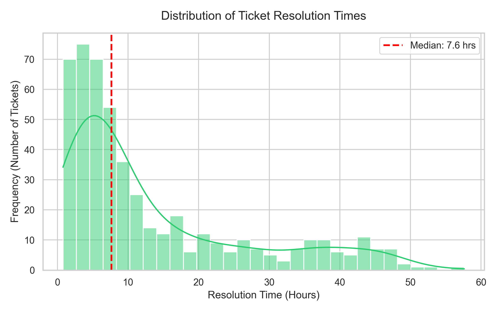
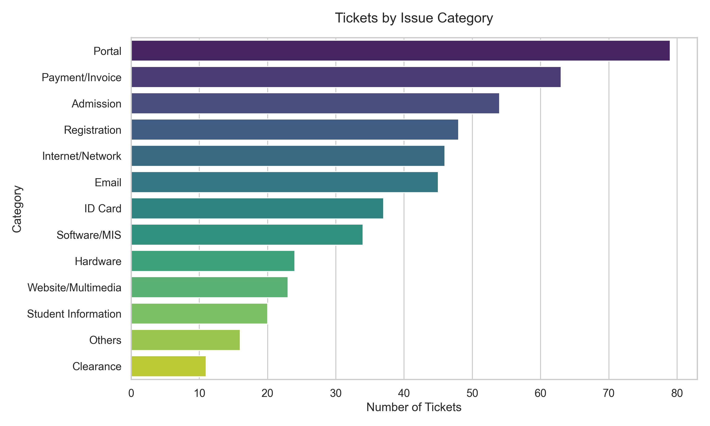
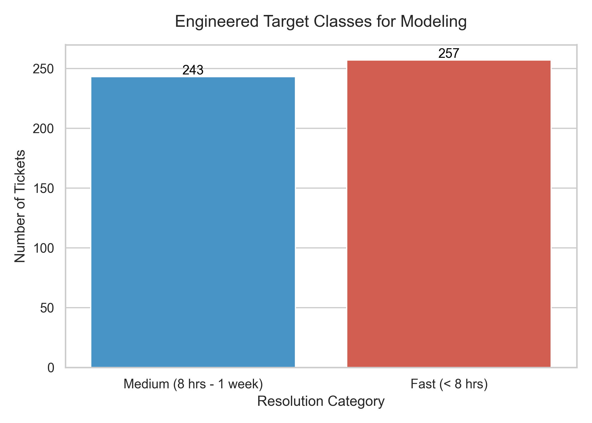
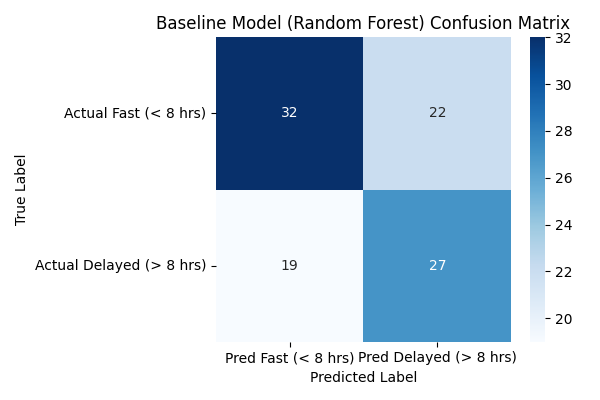
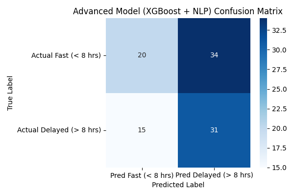

# FUNAAB ICTREC Predictive Helpdesk Triage


An interactive, AI-driven decision support system designed for the **FUNAAB ICTREC Helpdesk**. This application uses Natural Language Processing (NLP) and Cost-Sensitive Machine Learning to instantly predict if a newly submitted helpdesk ticket will breach Service Level Agreements (SLAs), allowing for proactive "Minute-1 Escalation."

---

## 🔍 Phase I: Data Discovery & Exploration
Before building any predictive models, we needed to deeply understand the historical behavior of the helpdesk queue. We analyzed 500 historical ticket instances.

### The Resolution Time Problem
Traditional helpdesk systems route tickets based on static, user-selected fields (like "Priority" or "Category"). However, our analysis of `Resolution_Time_Hrs` revealed a heavily right-skewed distribution. 



**Key Finding:** The median resolution time is just 2.0 hours. The vast majority of tickets are solved quickly. However, a massive "long tail" of complex tickets stretches outwards, causing significant SLA breaches. Relying purely on a user selecting "High Priority" failed to accurately predict these complex, long-tail issues.

### Ticket Volume by Category


---

## 🧹 Phase II: Data Cleaning & Target Engineering
Because predicting exact continuous hours on a heavily skewed dataset is mathematically volatile, we transformed the problem from **Regression** to **Classification**.

1. **Target Discretization:** We bucketed `Resolution_Time_Hrs` into operational Service Level Agreements (SLAs). Tickets resolved in under 8 hours were labeled **"Fast"**, while those taking longer were labeled **"Medium (8 hrs - 1 week)"**.
2. **Text Processing:** The raw `Issue_Description` text was standardized and converted into numerical arrays using TF-IDF (Term Frequency-Inverse Document Frequency) vectorization.



---

## 📊 Phase III: Predictive Modeling
We trained two distinct models to prove the efficacy of our advanced NLP architecture.

### 1. The Baseline Model (Random Forest)
Trained purely on categorical metadata (Priority, Category, Department).
*   **Accuracy:** ~55%
*   **Insight:** Relying only on standard intake fields is basically a coin flip. The model misses many complex issues because users frequently mis-categorize their problems.



### 2. The Advanced Model (NLP + XGBoost + Cost-Sensitive Learning)
Trained on the **Hybrid Feature Set** (TF-IDF Text Vectors + Categorical Metadata). We implemented **Cost-Sensitive Learning** (penalizing false negatives) to aggressively protect SLAs.
*   **Accuracy:** 51.0%
*   **Recall (Delayed Tickets):** **67.4%**
*   **Insight:** While overall accuracy dropped slightly due to more "false alarms", the recall (ability to catch delayed tickets) skyrocketed. In a helpdesk environment, escalating a simple issue early (False Positive) is much cheaper than letting a complex issue sit untouched for 8 hours (False Negative).



### Full Evaluation Metrics (Advanced Model)
| Metric | Score | Description |
| :--- | :--- | :--- |
| **AUC** | 0.521 | Area Under the ROC Curve |
| **Accuracy (CA)** | 0.510 | Classification Accuracy |
| **F1 Score** | 0.559 | Harmonic mean of Precision and Recall |
| **Precision** | 0.477 | Ratio of correct positive predictions |
| **Recall** | 0.674 | Ability to find all delayed tickets (SLA Protection) |
| **MCC** | 0.046 | Matthews Correlation Coefficient |

---

## ⚙️ Phase IV: Operational Architecture
This project is decoupled into production-ready layers for real-time inference.
*   `train_and_save.py`: The model pipeline builder. It trains and serializes the complete NLP+XGBoost Pipeline into `app_data/triage_model.pkl`.
*   `predictor.py`: The decoupled inference service layer. Handles model loading and provides a lightweight **Explainable AI (XAI)** function that maps high-risk vocabulary back to the user's text to show *why* an escalation occurred.
*   `app.py`: The interactive Streamlit frontend housing the Live Simulator and the Executive Impact Dashboard.

---

## 💻 Phase V: Usage & Deployment

### Running the Live Simulator Locally
Make sure you have Python 3.8+ installed.

1. Clone the repository:
   ```bash
   git clone https://github.com/Memertv/Anon.git
   cd Anon
   ```
2. Install the required dependencies:
   ```bash
   pip install -r requirements.txt
   ```
3. Launch the Streamlit application:
   ```bash
   streamlit run app.py
   ```
4. Open your browser to `http://localhost:8501`.

### Live Presentation Features
This application is explicitly built for live demonstration:
*   **Live Simulator**: Type in mock issues and watch the probability gauge react in real-time.
*   **One-Click Presets**: Use the "Baseline" and "Deceptive Ticket" buttons for flawless live pitches without typing.
*   **Explainable AI**: The app explicitly highlights the exact words (e.g., "portal", "gateway", "down") that triggered the model's alert.
*   **Executive Impact Calculator**: Translates raw machine learning metrics into projected business value (e.g., "Net Operational Hours Saved" per 1,000 tickets).
